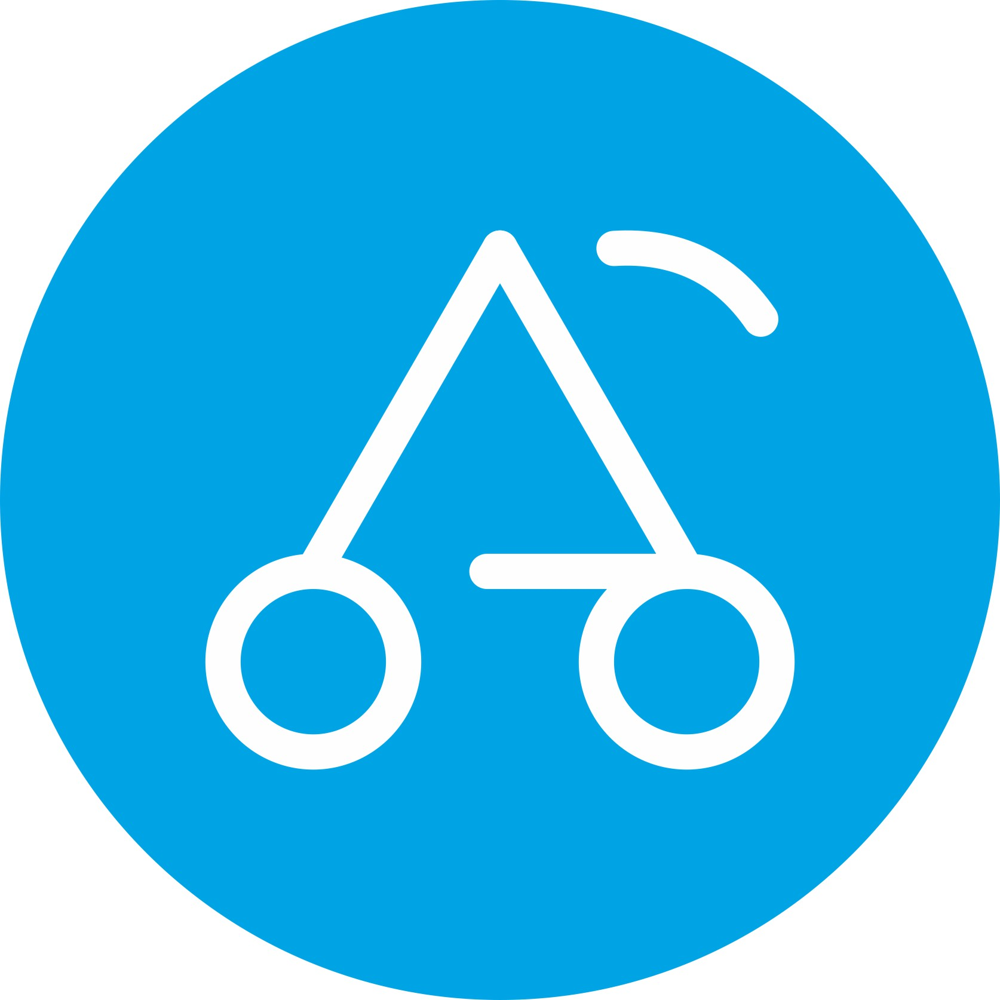

[](https://badge.fury.io/rb/carriage)
[](https://codeclimate.com/github/skatkov/carriage/maintainability)
[](https://travis-ci.org/skatkov/carriage)

# Carriage
<p align="center">
  
</p>

Carriage is a Ruby wrapper to [Amazon's Cart Form](https://webservices.amazon.com/paapi5/documentation/add-to-cart-form.html) functionality. Gem helps add any number of items to customer's shopping cart and direct him to Amazon website to complete order. 

To use this gem, you will eventually require Amazon's **AssociateTag**, so consider to [register first](https://webservices.amazon.com/paapi5/documentation/register-for-pa-api.html) with Amazon Associate program and become more familiar with it.

Programmatic access to product data is out of scope for this gem, but I recommend to use [vacuum gem](https://github.com/hakanensari/vacuum) if there is such a need.

[Battle tested at aShop](https://www.ashop.co/?utm_source=carriage-gem)

## Installation

Add this line to your application's Gemfile:

```ruby
gem 'carriage'
```

And then execute:

    $ bundle install

Or install it yourself as:

    $ gem install carriage

## Usage

A lot of examples could be found [in tests](https://github.com/skatkov/carriage/blob/master/test/carriage_test.rb)

There are basically two ways to use this gem `bare metal` and with `builder`. Let's start off with baremetal:

### Bare metal
```
Carriage.call(:us, {
  AssociateTag:'tag', 
  "OfferListingId.1": "B00WR23X5I", 
  "Quantity.1": 1 
 }
)
```
The only thing it will validate, is a presence of locale. All other parameters will be converted by `URI.encode_www_form` without any verification. Be carefull!

### Builder
Library also offers a simpler interface that tries to valide data with convinince methods on top.

```
items = [
 {Id: '123123'}.
 {ASIN: '1231234', quantity: 2}
]

Carriage.build(items, tag: 'my_attribution_tag', locale: :uk)
```

* Every item should be a hash, with `ASIN` or `ID` (short for `OfferListingId`) key provided. All keys are _case insensitive_.
* By default quantity is 1, feel free to rewrite that. 
* `Carriage.build` also requires `:tag` attribute (short for `AssociateTag`)
*  Defaults to `locale: :us`, if no other locale was provided.

### Locale
All locale are based on a two letter country codes - **ISO 3166-1 alpha-2**. Here is an exact mapping:

https://github.com/skatkov/carriage/blob/master/lib/carriage/locale.rb#L7-L23

## Getting help

* Ask specific questions about the API on the [Amazon forum](https://forums.aws.amazon.com/forum.jspa?forumID=9).
* Report bugs and discuss potential features in [GitHub issues](https://github.com/skatkov/carriage/issues).

## Credits
Logo was done by [Max Kazmin](https://dribbble.com/maxpainter)

## License

The gem is available as open source under the terms of the [MIT License](https://opensource.org/licenses/MIT).

## Code of Conduct

Everyone interacting in the Carriage project's codebases, issue trackers, chat rooms and mailing lists is expected to follow the [code of conduct](https://github.com/skatkov/carriage/blob/master/CODE_OF_CONDUCT.md).
